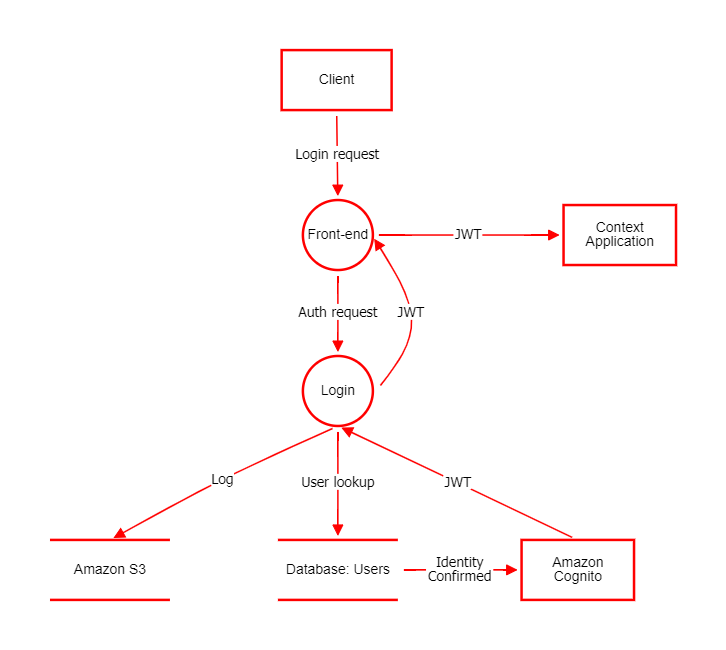

# Atividade 1 — Modelagem de Ameaças: Fluxo de Login em Cloud

## Descrição

Modelagem de ameaças do processo de login de uma aplicação convencional hospedada em nuvem, considerando os protocolos utilizados nas comunicações e os possíveis ataques que esse fluxo pode receber.

**Metodologia:** STRIDE
**Ferramenta:** OWASP Threat Dragon

---

## Diagrama

---

## Ameaças Identificadas (STRIDE)

| # | Componente | Categoria | Ameaça |
|---|---|---|---|
| 1 | Client | Spoofing | Uso de credenciais vazadas (Credential Stuffing) |
| 2 | Front-end | Information Disclosure | JWT armazenado em localStorage exposto a XSS |
| 3 | Login | Spoofing | Ataque de força bruta na autenticação |
| 4 | Context Application | Elevation of Privilege | JWT aceito sem validação de escopo |
| 5 | Database: Users | Information Disclosure | Senhas armazenadas sem hash |
| 6 | Amazon S3 | Information Disclosure | Bucket de logs com acesso público |
| 7 | Amazon Cognito | Spoofing | Falsificação do provedor de identidade |
| 8 | JWT (Login → Front-end) | Information Disclosure | JWT transmitido em cookie sem flag HttpOnly |
| 9 | JWT (Front-end → Context App) | Spoofing | Reutilização de JWT (Replay Attack) |
| 10 | JWT (Cognito → Login) | Tampering | Algoritmo JWT alterado para alg:none |
| 11 | Log (Login → S3) | Information Disclosure | Senha do usuário registrada nos logs |
| 12 | Login request (Client → Front-end) | Information Disclosure | Comunicação sem HTTPS expõe credenciais |
| 13 | Auth request (Front-end → Login) | Tampering | Manipulação de parâmetros da requisição |
| 14 | User lookup (Login → Database) | Tampering | SQL Injection na consulta de usuário |
| 15 | Identity Confirmed (Database → Cognito) | Spoofing | Falsificação da confirmação de identidade |

---

## Arquivos

| Arquivo | Descrição |
|---|---|
| `diagram.png` | Diagrama DFD do fluxo de login |
| `Modelagem de Ameaças - Fluxo de Login em Cloud.json` | Modelo Threat Dragon com ameaças mapeadas |
| `Modelagem de Ameaças - Fluxo de Login em Cloud.pdf` | Relatório completo da atividade |
